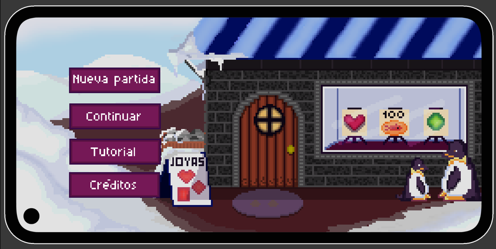
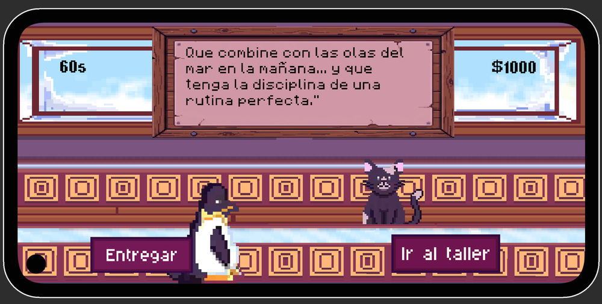
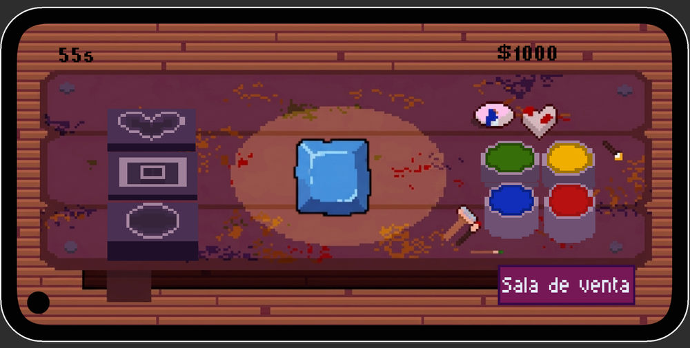
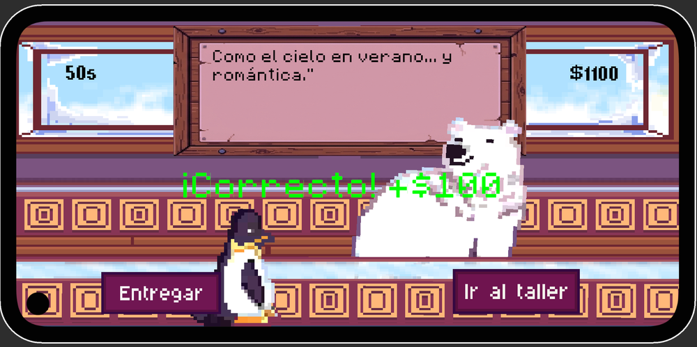
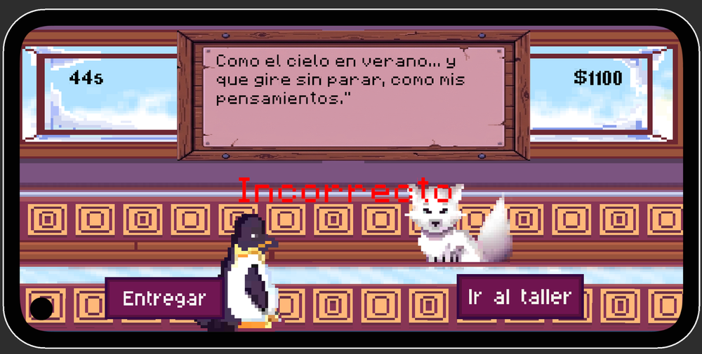
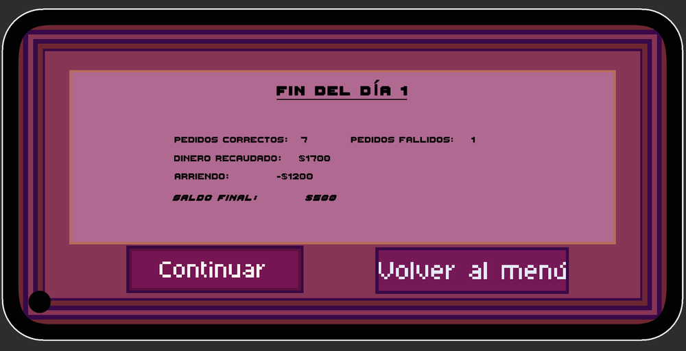
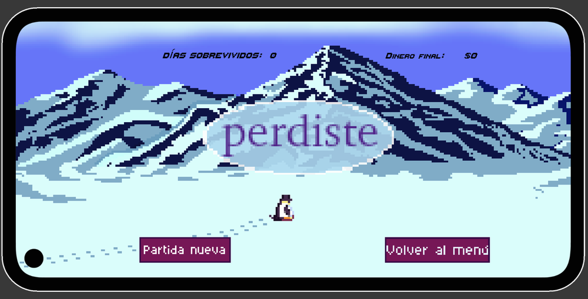
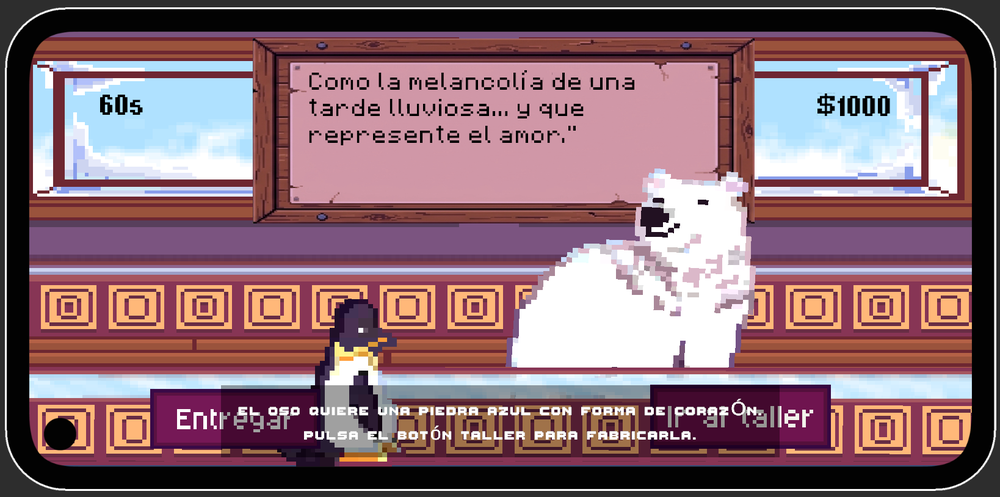
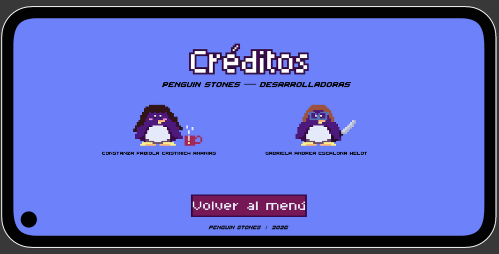

# 🐧 Penguin Stones

**Juego móvil casual en pixel art donde administras una joyería de piedras preciosas en la Antártida.**

---

## ¿De qué trata?

Eres un pingüino joyero que atiende a clientes muy particulares (osos polares, gatos, zorros árticos…). Cada cliente llega con un pedido descrito de forma poética, como *"Como la melancolía de una tarde lluviosa… y que represente el amor"*, y tu trabajo es **interpretarlo, fabricar la piedra correcta en el taller y entregarla** antes de que se acabe el tiempo.

Si lo haces bien, ganas dinero. Si te equivocas, no. Y al final de cada día hay que pagar el arriendo: **si no alcanzas a pagarlo, lo pierdes todo.**

---

## Flujo de juego

### 1. Recibe pedidos
Un cliente llega con una descripción de la piedra que quiere. Hay un temporizador en marcha y el dinero acumulado se muestra en pantalla.

### 2. Crea las piedras preciosas en el taller
Desde el taller eliges la forma (corazón, cuadrada, ovalada) y la pintas con los colores disponibles hasta que coincida con el pedido.

### 3. Entrega y cobra… si lo hiciste bien
Al volver a la sala de venta entregas la piedra. Si acertaste, recibes el pago.

…o no, si te equivocas.

### 4. Lo importante: pagar el arriendo
Al terminar el día se muestra el resumen: pedidos correctos y fallidos, dinero recaudado, arriendo y saldo final.

### 5. Si no lo pagas… pierdes todo
La partida termina mostrando los días sobrevividos y el dinero final.

---

## Otras pantallas

| Tutorial | Créditos |
|---|---|
|  |  |

El menú principal incluye **Nueva partida**, **Continuar**, **Tutorial** y **Créditos**.

---

## Tecnologías

- **Motor:** Unity `[versión, ej. 2022.3 LTS]`
- **Lenguaje:** C#
- **Arte:** pixel art
- **Plataforma:** móvil, orientación horizontal `[Android / iOS]`

---

## Cómo probarlo

- **Descargar el juego:** `[link a Releases o a itch.io]`
- **Abrir el proyecto en Unity:**
  1. Instala Unity Hub y la versión indicada arriba.
  2. Clona el repositorio: `git clone https://github.com/gescalonaw/[nombre-del-repo].git`
  3. En Unity Hub: *Add → Add project from disk* y selecciona la carpeta.
  4. Abre la escena `[Assets/Scenes/MainMenu]` y presiona *Play*.

---

## Créditos

Desarrollado por **Constanza Fabiola Cristinich Ananias** y **Gabriela Andrea Escalona Weldt** · Penguin Stones, 2026.
